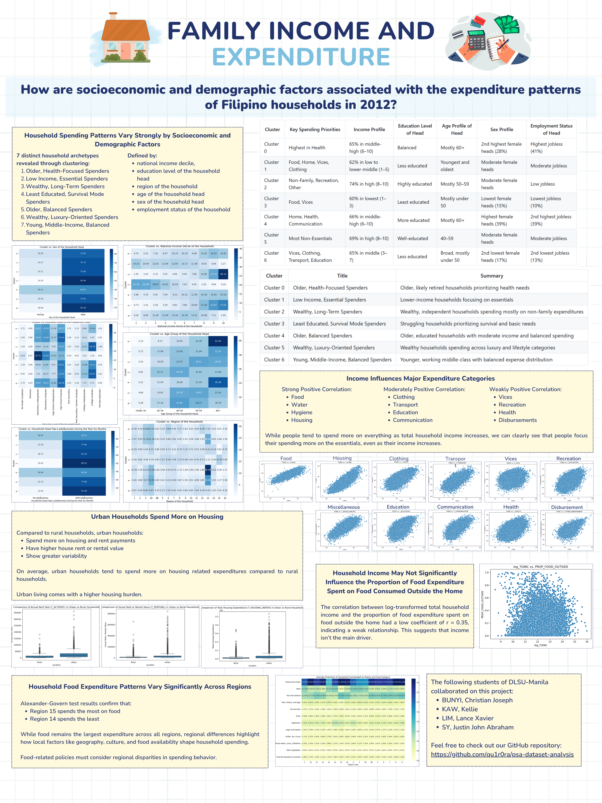

# PSA Dataset Analysis: Family Income and Expenditure




 

A comprehensive analysis of a dataset provided by the Philippine Statistics Authority (PSA), specifically the Family Income and Expenditure Survey (FIES) 2012. Created for CSMODEL (Statistical Modeling and Simulation).

## Overview

This exploratory data analysis (EDA) project investigates the following core research question:
**How are socioeconomic and demographic factors associated with the expenditure patterns of Filipino households in 2012?**

Through **Data Mining**, **Clustering**, and **Statistical Inference**, this project uncovers insights about:

- The variation of household spending patterns driven by socioeconomic and demographic factors.
- Regional differences in household food expenditure.
- The correlation between total household income and major expenditure categories.
- Differences in housing expenditure between urban and rural households.

## Repository Structure

A high-level overview of the repository organization:

```text
.
├── assets/             # Project poster and other visual assets
├── data/               # FIES 2012 dataset files
├── docs/               # Machine project specifications and documentation
├── src/                # Modular Python scripts backing the analysis
│   ├── constants.py    # Dict mappings for categories and lists
│   ├── preprocessing.py# Data cleaning and type conversion functions
│   └── visualizations.py# Generators for charts and summary tables
├── fie-analysis.ipynb  # Frontline Jupyter Notebook containing full EDA
├── pyproject.toml      # uv setup configuration
└── uv.lock             # uv lockfile for Python dependency management
```
